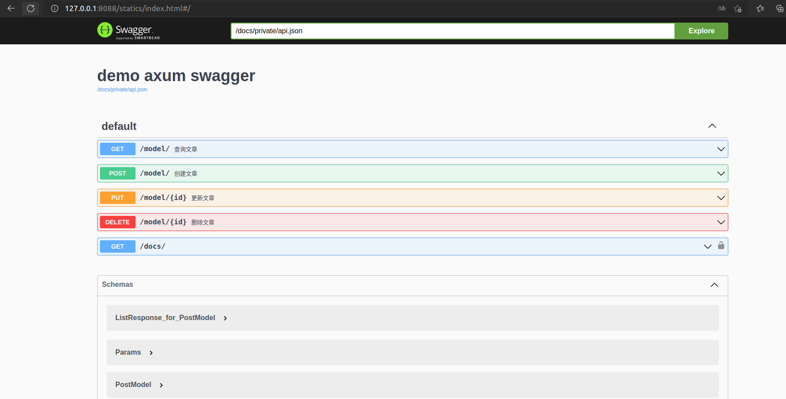

## `demo-axum`

This is a restful framework use `axum`, `sea-orm`, `aide`

## Quick start

start the docker compose service

```
$ docker compose up -d
```

run cargo command

```
$ cargo build -r 
```

change the `env`

```
$ cp env.template .env
```

run the server now 

```
$ ./target/release/demo-axum
```

open your chrome or `firefox` for the `url` `http://127.0.0.1:8088/statics/index.html`




benchmark

need project `rewrk`

install 

```
$ cargo install rewrk -git https://github.com/ChillFish8/rewrk.git
```

bench 

```
$ rewrk -h http://127.0.0.1:8088/model -t 12 -c 60 -d 20s
```

